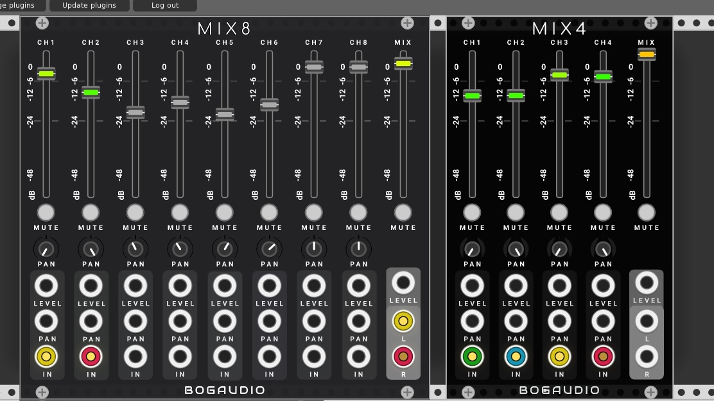

# Dark mode: BogaudioModules

Modules for [VCV Rack](https://github.com/VCVRack/Rack), an open-source Eurorack-style virtual modular synthesizer:

  -test for dark mode: 
  
  
 
## Issues and Feedback

Bug reports and feedback are welcome: please use the [issue tracker](https://github.com/bogaudio/BogaudioModules/issues).

## Acknowledgements

Uses [FFTReal](https://github.com/cyrilcode/fft-real) under the DWTFYWT Public License.
